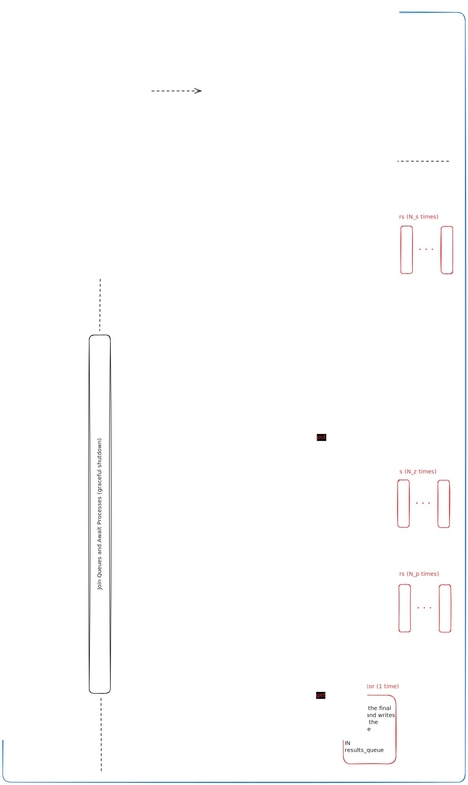

# vianu-fraudcrawler
Intelligent Market Monitoring

The pipeline for monitoring the market has the folling main steps:
1. search for a given term using SerpAPI
2. get product information using ZyteAPI
3. assess relevance of the found products using an OpenAI API

## Installation
```bash
python3.11 -m venv .venv
source .venv/bin/activate
pip install vianu-fraudcrawler
```

## Usage
### Run demo pipeline
```bash
python -m fraudcrawler.launch_demo_pipeline
```

### Customize the pipeline
Start by initializing the client
```python
from fraudcrawler import FraudCrawlerClient

# Initialize the client
client = FraudCrawlerClient()
```

For setting up the search we need 5 main objects
- `search_term`: The search term for the query.
- `location`: The SerpAPI location used for the query.
- `deepness`: Defines the search depth.
- `context`: The context prompt to use for detecting relevant products

```python
from fraudcrawler import Location, Deepness
# Setup the search
search_term = "sildenafil"
location = Location(name="Switzerland")
deepness = Deepness(num_results=50)
context = "This organization is interested in medical products and drugs."
```

(Optional) Add search term enrichement. This will find related search terms (in a given language) and search for these as well.
```python
from fraudcrawler import Enrichment
deepness.enrichement = Enrichment(
    language=Language(name="German")
    additional_terms=5,
    additional_urls_per_term=5
)
```

(Optional) Add marketplaces where we explicitely want to look for (this will focus your search as the :site parameter for a google search)
```python
from fraudcrawler import Host,
marketplaces = [
    Host(name="Ricardo", domains="ricardo.ch"),
    Host(name="Galaxus", domains="digitec.ch, galaxus.ch")
]
```

(Optional) Exclude urls (where you don't want to find products)
```python
excluded_urls = [
    Host(name="Altibbi", domains="altibbi.com")
]
```

And finally run the search
```python
# Run the search
client.run(
    search_term=search_term,
    location=location,
    deepness=deepness,
    context=context,
    # marketplaces=marketplaces,    # Uncomment this for using marketplaces
    # excluded_urls=excluded_urls   # Uncomment this for using excluded_urls
)
```
This creates a file with name pattern `<search_term>_<date>.csv` inside the folder `data/products`.

## Contributing
see `CONTRIBUTING.md`

### Async Setup
The following image provides a schematic representation of the package's async setup.

